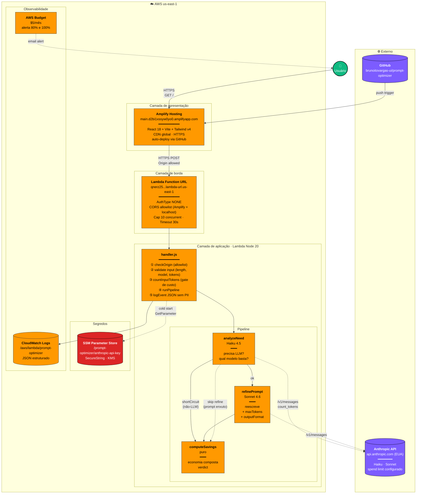
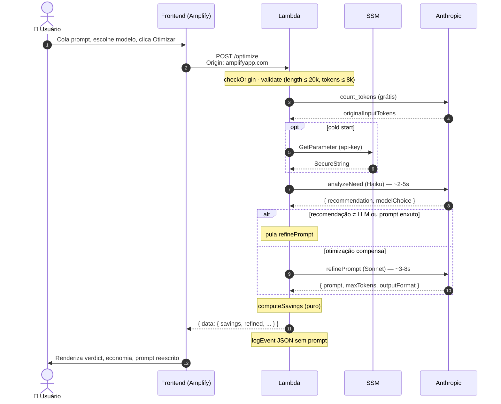
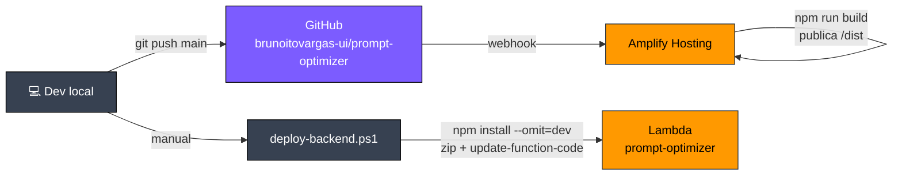

# Arquitetura — Prompt Cost Optimizer

## Visão geral



## Fluxo crítico de uma requisição



## Pipeline de deploy



## Camadas em uma linha

| Camada | Tecnologia | Função |
|---|---|---|
| Apresentação | Amplify Hosting + React/Vite | UI, validação client-side, CDN global |
| Borda | Lambda Function URL + CORS | Endpoint público, CORS + origin allowlist |
| Aplicação | Lambda Node 20 | Pipeline de otimização, validação, logging |
| Segredo | SSM Parameter Store | Chave Anthropic encriptada em repouso |
| LLM | Anthropic API | Análise + reescrita do prompt |
| Observabilidade | CloudWatch + Budgets | Logs JSON e alerta de custo |
| CI/CD | GitHub + Amplify auto-build + PS scripts | Push dispara frontend; backend manual |

## Imagens renderizadas

| Diagrama | Arquivo |
|---|---|
| Arquitetura completa | [`architecture-1.png`](./architecture-1.png) |
| Fluxo de requisição | [`architecture-2.png`](./architecture-2.png) |
| Pipeline de deploy | [`architecture-3.png`](./architecture-3.png) |

## Como regenerar

```powershell
npx -y @mermaid-js/mermaid-cli@latest -i docs/architecture.md -o docs/architecture.png -b transparent
```

## Como visualizar

- **No GitHub**: este arquivo renderiza automaticamente os diagramas Mermaid — abre `docs/architecture.md` no repositório.
- **VSCode**: instale a extensão "Markdown Preview Mermaid Support".
- **Online**: cola o bloco mermaid em https://mermaid.live e exporta SVG/PNG.
